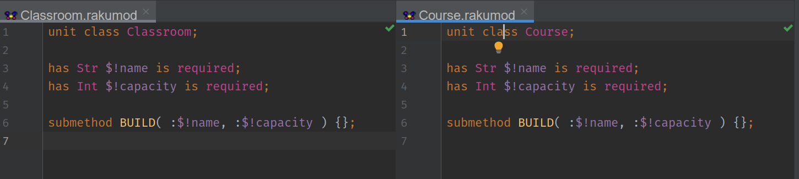

# Scheduling classes

Every year by tht beginning of the school year, which starts by
January 8th in the North Pole, after every version of the Christmas
gift-giving spirit has made their rounds, Santa needs to sit down to
schedule the classes of the North Pole Community College. These elves
need continous education, and they need to *really* learn about those
newfangled toys, apart from the tools and skills of the trade.

> Plus it's a good thing to have those elves occupied during the whole
> year in something practical and useful, so that they don't start to
> invent practical jokes and play them on each other.

Since there are over one million elves, the NPCC is *huge*. But
there's also a *huge* problem assigning courses to classrooms. Once
registration for classes is open, they talk to each other about what's
the ultimate blow off class, which one gives you extra credit for
winning snowball fights. So you can't just top up enrolment: every
year, you need to check the available classrooms, and then match it to
the class that will be the most adequate for it.

Here'are the available classrooms:


```text
Kris, 33
Kringle, 150
Santa, 120
Claus, 120
Niklaas, 110
Reyes Magos, 60
Olentzero, 50
Papa Noël, 30
```

They're named after gift-giving spirits from all over the world, with
the biggest class obviously named Kringle. In any given year, this
could be the enrolment after the registration period is over.

```text
Woodworking 101, 130
Toymaking 101, 120
Wrapping 210, 40
Reindeed speed driving 130, 30
ToyOps 310, 45
Ha-ha-haing 401, 33
```

They love woodworking 101, because it's introductory, and they get to
keep whatever assignment they do during the year. Plus you get all the
wood parings for burning in your stove, something immensely useful in
a place that's cold all year long.

So Santa created this script to take care of it, using a bit of [point
free programming](https://raku-advent.blog/2020/12/22/draft-whats-the-point-of-point-free-programming/) and
[Perl being Perl](https://raku-advent.blog/2020/08/20/rfc-28-by-simon-cozens/),
the whippipitude and dwimmability of the two sister languages, Perl
and Raku.

```perl6
sub read-and-sort( $file where .IO.e ) {
    $file.IO.lines
      ==> map( *.split( /","\s+/) )
      ==> sort( { -$_[1].Int } )
      ==> map( { Pair.new( |@_ ) } )
}

say (read-and-sort( "classes.csv") Z read-and-sort( "courses.csv"))
    .map( {  $_.map( { .key } ).join( "\t→\t") }  )
    .join( "\n" )
```

The subroutine reads the file given its name, checking that it exists
before, splits it by the comma, sorts it in decreasing number, and
then creates a pair out of it. The other command uses
the [`Z` operator](https://docs.raku.org/routine/Z) to zip the two
lists together in decreasing order of elves, and produce a list just
like this one:

```text
Kringle	→	Woodworking 101
Santa	→	Toymaking 101
Claus	→	ToyOps 310
Niklaas	→	Wrapping 210
Reyes Magos	→	Ha-ha-haing 401
Olentzero	→	Reindeed speed driving 130
```

So the Kringle lecture hall gets woodworking, and it goes down from
there. The Kris  and Papa Noël classroom get nothing, having been
eliminated but kept there to be used for extra-curricular activities
such as carol singing and origami.

All this works well while it does: as long as you remember where're
the files, what the script did, nothing changes name or capacity, and
the files are not lost. But those are a lot of ifs, and Santa is not
getting any younger

> As a matter of fact, not getting any older either.

So Santa and its ToyOps team will need a more systematic approach to
this scheduling, by creating an object oriented application from
requirements. After learning all
about
[`TWEAKS`](https://raku-advent.blog/2020/12/11/day-11-santa-claus-tweaks-with-a-class/#fn-3) and
[roles](https://raku-advent.blog/2020/12/21/the-story-of-elfs-and-roles-and-santas-enterprise/),
now it's the time to stand back and put it to work from the very
beginning.

## Agile scheduling

The cold that pervades the North Pole makes everything a little less
agile. But no worries, we can still be agile when we create something
for IT operations there. First thing we need are [user stories](https://www.atlassian.com/agile/project-management/user-stories). Who
wants to create a schedule and what is it? So let's sit down and write
them down.

- [US1] As a NPCC dean, given I have a list of classrooms (and their
  capacity) and a list of courses (and their enrolment), I want to
  assign classrooms to courses in the best way possible.

OK, we got something to work on here, so we can apply [a tiny bit of
domain driven design](https://en.wikipedia.org/wiki/Domain-driven_design). We
have a couple of entities, classrooms and courses, and a few value
objects: single classrooms and single courses. Let's go and write
them. Using Comma, of course.



Using classes for classes is only natural. But looking at the two
defined classes, Santa couldn't say which was which. At the end of the
day, something with a name and a capacity is something with a name and
a capacity. This begs for a factoring out of the common code,
following the DRY (don't repeat yourself) principle.

Besides, we have a prototype above that pretty much says that whatever
we use for classrooms and courses, our life is going to be easier if
we can sort it in the same way. So it's probably best if we spin off a
role with the common behavior. Let's call it `Capped`, as in having a
certain capacity.
